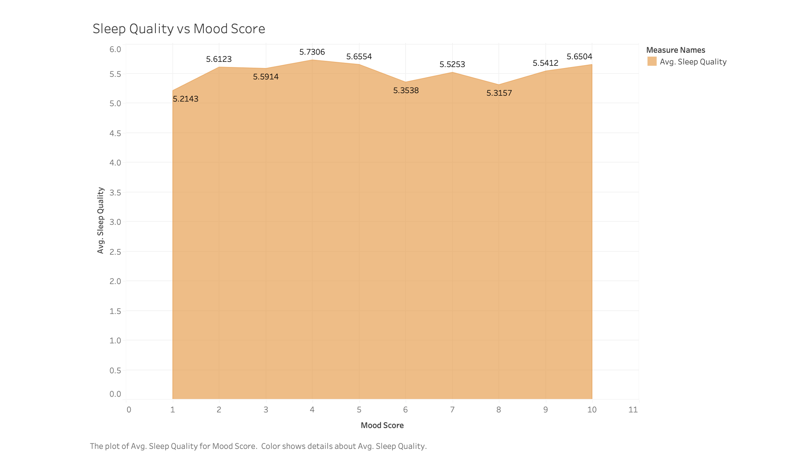
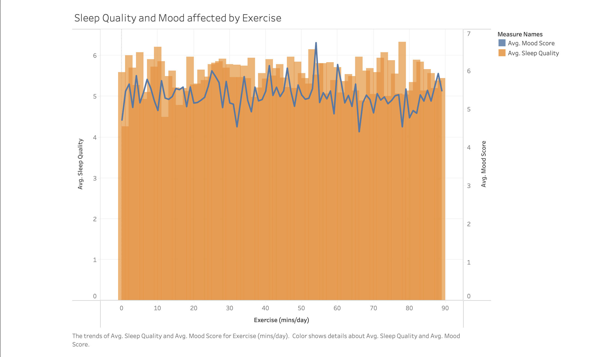
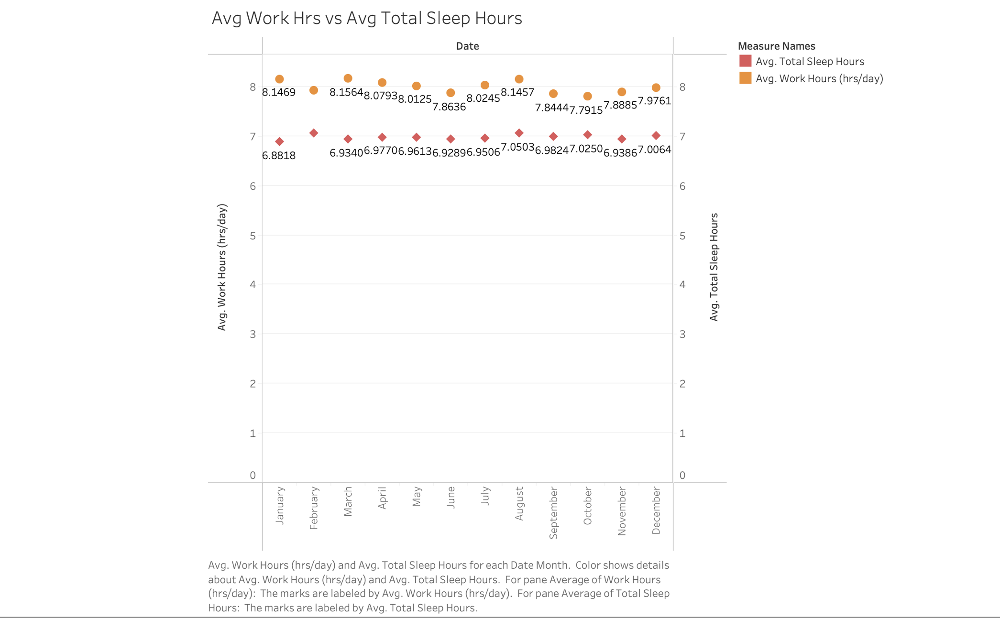
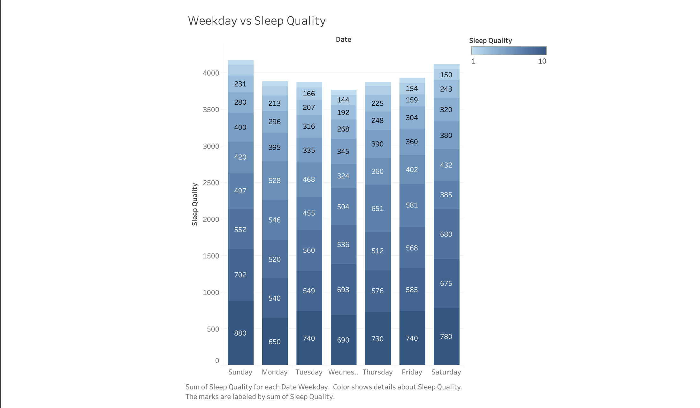
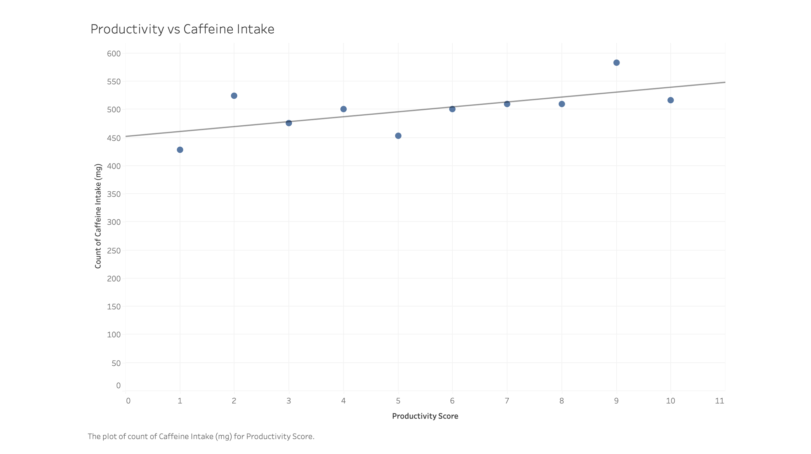

# Sleep Pattern Analysis & Productivity Insights
### Data Visualization Project | Excel • Tableau

## Project Overview

This project explores how lifestyle behaviors influence sleep quality and productivity using data visualization techniques.

Using Excel and Tableau, multiple visualizations were developed to examine relationships between sleep quality, mood, exercise, work hours, caffeine consumption, and productivity.

The objective of this analysis is to demonstrate how data visualization can uncover behavioral patterns and provide insights into how everyday lifestyle choices impact sleep health and daily performance.

## Tools Used

- Excel – data preparation and dataset exploration
- Tableau – data visualization and chart development
- GitHub – project documentation and portfolio presentation

## Dataset

The dataset used in this project comes from a public Kaggle dataset examining sleep cycles and productivity factors.

Key variables include:

- Total Sleep Hours
- Sleep Quality Score
- Exercise (minutes per day)
- Caffeine Intake (mg)
- Work Hours (hours per day)
- Productivity Score
- Mood Score

Source:  
https://www.kaggle.com/datasets/adilshamim8/sleep-cycle-and-productivity

## Analytical Approach

The analysis explores how multiple lifestyle variables interact with sleep quality and productivity.

Key analytical steps included:

- Identifying correlations between sleep quality and mood
- Examining the relationship between work hours and sleep duration
- Analyzing caffeine consumption patterns
- Exploring how exercise impacts both mood and sleep quality
- Visualizing productivity trends relative to caffeine intake

Multiple visualization techniques were used including:

- Area charts
- Scatter plots
- Dual-axis charts
- Stacked bar charts
- Trend lines

These visualizations help reveal behavioral patterns that may not be immediately obvious from raw data alone.

### Sleep Pattern Analysis Report

The full project report provides a detailed breakdown of the data visualizations and analytical reasoning used throughout this project.

The report explores how lifestyle variables—including mood, exercise, work hours, and caffeine intake—interact with sleep quality and productivity. Through multiple visualizations such as area charts, dual-axis charts, stacked bar charts, and scatter plots, the analysis highlights behavioral patterns that influence both sleep and daily performance.

Key sections of the report examine:
- The relationship between sleep quality and mood
- How exercise levels influence both sleep quality and emotional well-being
- The impact of work hours on sleep duration and weekday sleep patterns
- The role caffeine consumption plays in both productivity and sleep quality

Overall, the report demonstrates how data visualization can uncover meaningful trends in lifestyle behaviors and emphasizes the importance of balanced habits—such as moderate exercise, manageable work hours, and mindful caffeine consumption—to support better sleep and overall well-being.

[View the Full Sleep Pattern Analysis Report](sleep-pattern-analysis-report.pdf)

## Key Visualizations

### Sleep Quality vs Mood Score

This visualization analyzes how mood scores relate to average sleep quality. The data shows that sleep quality tends to improve when mood scores increase, highlighting a strong connection between emotional well-being and restful sleep.

### Exercise Impact on Sleep and Mood

A dual-axis chart compares exercise duration with sleep quality and mood scores. Moderate exercise levels appear to correlate with the highest sleep quality and mood scores.

### Work Hours vs Sleep Hours

A scatter plot illustrates the relationship between work hours and total sleep hours. The analysis suggests that increased work hours generally correspond with reduced sleep duration.

### Weekday Sleep Quality Patterns

A stacked bar chart visualizes sleep quality across days of the week. Sleep quality tends to decrease during weekdays and improve on weekends, likely due to reduced work demands.

### Caffeine Intake vs Productivity

A scatter plot with a trend line shows a positive relationship between caffeine consumption and productivity scores, suggesting that moderate caffeine intake may support productivity.

## Key Insights

The analysis highlights several behavioral patterns:

- Higher work hours are associated with reduced sleep duration
- Moderate exercise improves both mood and sleep quality
- Caffeine intake may slightly reduce sleep quality but can improve productivity
- Sleep quality tends to improve during weekends when work demands decrease

These findings illustrate how everyday lifestyle decisions influence sleep health and overall well-being.

## Files Included

- `sleep-productivity-dataset.xlsx` – dataset containing sleep, exercise, caffeine, mood, and productivity metrics

- `sleep-pattern-analysis-report.pdf` – presentation explaining the analysis process, visualizations, and key findings

- `visuals/` – folder containing visualization screenshots used in the analysis
  - `sleep-quality-mood.png` – relationship between sleep quality and mood score
  - `exercise-sleep-mood.png` – exercise impact on sleep quality and mood
  - `work-hours-vs-sleep.png` – comparison of work hours and total sleep hours
  - `weekday-sleep-quality.png` – sleep quality trends across days of the week
  - `caffeine-productivity.png` – relationship between caffeine intake and productivity score

- `README.md` – project documentation and explanation of the analysis
